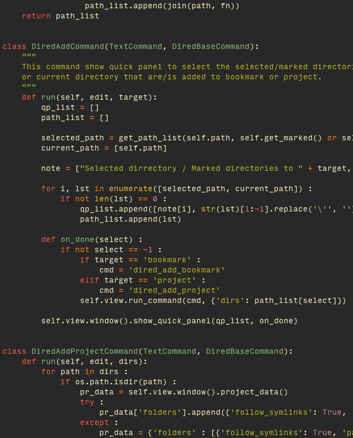
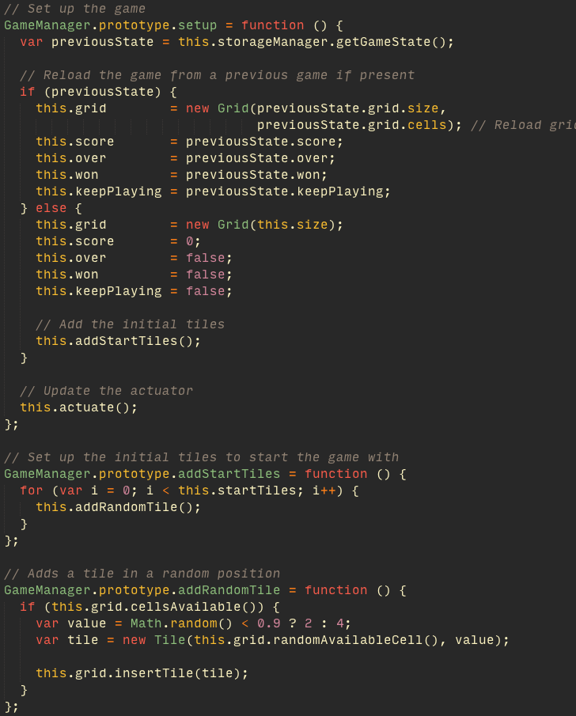
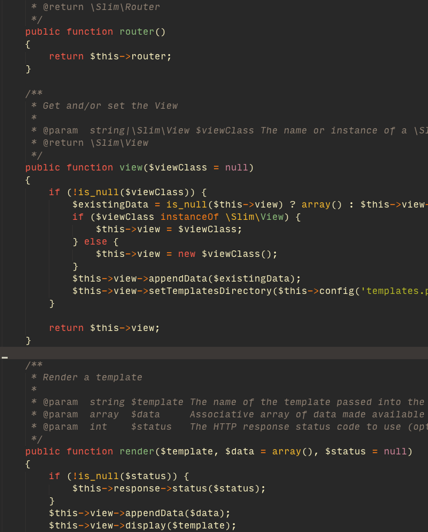
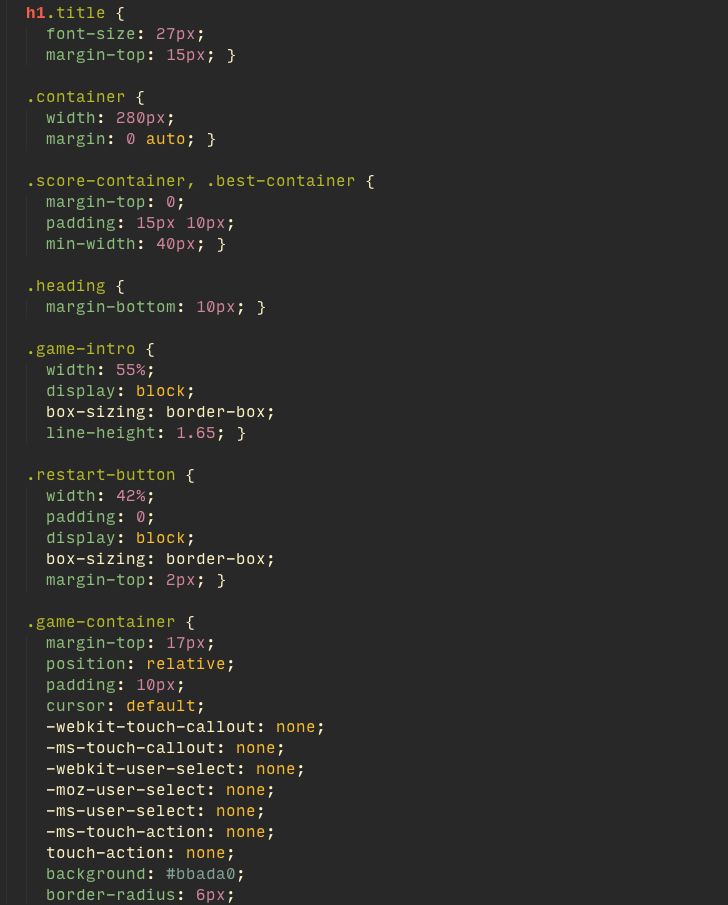
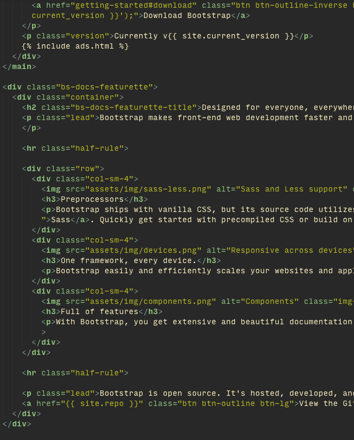

# gruvbox #

Color scheme port of [gruvbox](https://github.com/morhetz/gruvbox) dark mode to Sublime Text.  

It's not 100% match to original gruvbox. I've toned down red color a little bit, used different caret color and there are probably lots of inconsistencies in language specific highlighting (ST has different scheme rules than VIM).

If you want to have original red color then change in tmTheme all occurences of `fa5c4b` to `fb4934`.

## Examples
__Python__  
  
__JavaScript__  
  
__PHP__  
  
__CSS__  
  
__HTML__  
  

Font used in screenshots is Input Mono.

## Contribution
Feel free to contribute if you find any issues in color highlighting (especially in language specific highlighting).
